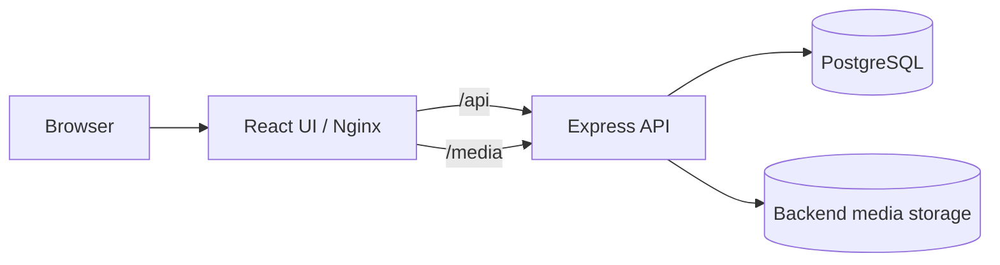

# Home Finder

Home Finder is a full-stack property-search application for homes in Denmark. The React UI displays searchable, filterable listings and a Leaflet map. All property metadata comes from the Express API, which reads PostgreSQL and serves property media from persistent backend storage.



## Project structure

```text
home-finder/
├── .github/workflows/ci.yml  Code-quality and Docker smoke CI
├── server/                   Express, PostgreSQL, migrations, seed media, tests
├── ui/                       React, Vite, Nginx, component tests, Playwright smoke test
├── docker-compose.yml        Complete local development stack
└── .env.example              Safe Docker Compose defaults
```

The UI requires a working backend. Property records and property images are not bundled into the frontend.

## Prerequisites

- Node.js 22.12 or newer
- npm 10 or newer
- Docker Desktop or another Docker Engine with Compose v2

## Environment configuration

Copy `.env.example` to `.env` only when you want to override Docker defaults. `.env` files are ignored by Git.

| Variable | Default | Purpose |
| --- | --- | --- |
| `POSTGRES_DB` | `home_finder` | PostgreSQL database |
| `POSTGRES_USER` | `home_finder` | PostgreSQL user |
| `POSTGRES_PASSWORD` | `home_finder` | Local-only PostgreSQL password |
| `POSTGRES_PORT` | `5432` | Host database port |
| `SERVER_PORT` | `3000` | Host API port |
| `UI_PORT` | `5173` | Host UI port |

Backend variables are documented in `server/.env.example`: `DATABASE_URL`, `PORT`, `UI_ORIGIN`, `STORAGE_ROOT`, and `NODE_ENV`. The UI optionally accepts `VITE_API_URL` for non-proxied environments; local Vite and Docker use same-origin `/api` and `/media` proxying, so it should remain unset.

## Complete Docker environment

Start the complete application with one command:

```powershell
docker compose up --build
```

Open:

- UI: `http://localhost:5173`
- API: `http://localhost:3000/api/properties`
- Scalar documentation: `http://localhost:3000/docs`
- OpenAPI specification: `http://localhost:3000/openapi.json`

Compose starts services in this order:

```text
postgres → migrate → seed → server → ui
```

`migrate` applies pending database migrations. After it succeeds, the one-shot `seed` service inserts the six sample properties and copies their images into the persistent media volume. The seed uses conflict-safe inserts and copies only missing files, so running `docker compose up --build` again does not create duplicate records or overwrite existing media. The server starts only after seeding succeeds, and the UI starts only after the server readiness check passes.

Stop containers while retaining data:

```powershell
docker compose down
```

Intentionally delete all development database and media data:

```powershell
docker compose down --volumes
```

The `postgres_data` volume stores PostgreSQL files. The `property_media` volume stores backend-managed property images. Recreating containers without `--volumes` preserves both.

To inspect initialization:

```powershell
docker compose ps -a
docker compose logs migrate seed
```

## Native development

### PostgreSQL and backend only

```powershell
docker compose up -d postgres
cd server
npm install
npm run db:migrate
npm run db:seed
npm run dev
```

The defaults connect to the Compose PostgreSQL port and store seeded media beneath `server/storage`. Seeding is idempotent: existing property IDs and media files are not overwritten.

Migration commands:

```powershell
npm run db:migrate
npm run db:rollback
npm run db:seed
```

### UI and backend

Keep PostgreSQL and the backend running, then use a second terminal:

```powershell
cd ui
npm install
npm run dev
```

Open `http://localhost:5173`. Vite proxies `/api` and `/media` to `http://localhost:3000`.

## API

| Endpoint | Purpose |
| --- | --- |
| `GET /health` | Process liveness |
| `GET /ready` | PostgreSQL readiness |
| `GET /api/properties` | List properties |
| `GET /api/properties/:id` | Get one property |
| `GET /media/properties/:file` | Read backend-managed property media |
| `GET /openapi.json` | OpenAPI 3.1 document |
| `GET /docs` | Scalar interactive API reference |

PostgreSQL stores stable media keys, not image binaries or Docker hostnames. The API converts those keys to relative `/media/...` URLs.

## Tests and code quality

Backend:

```powershell
cd server
npm run format:check
npm run lint
npm run typecheck
npm test
npm run build
```

Database repository tests run when `TEST_DATABASE_URL` is set. Migrate and seed that isolated database first; never point it at development data.

Frontend:

```powershell
cd ui
npm run format:check
npm run lint
npm run typecheck
npm test
npm run build
```

With the Docker stack running, execute the smoke test:

```powershell
cd ui
npx playwright install chromium
npm run test:e2e
```

## CI

GitHub Actions runs on pull requests and pushes to `main`. It verifies UI and server formatting, linting, types, tests, database migration/seed behavior, production builds, Docker Compose validity/builds, and the Playwright full-stack flow. CI does not deploy or publish images.
